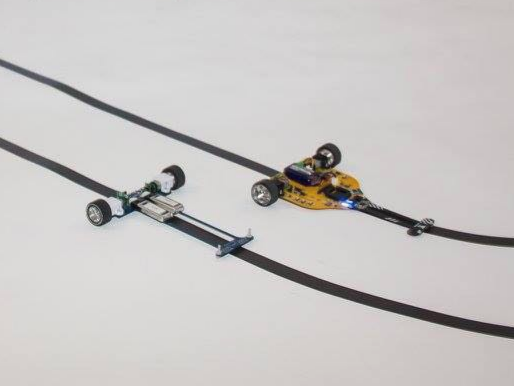

Normativa para velocistas - |version|
=====================================
La categoría de velocistas consiste en una prueba de velocidad en la que los robots deberán recorrer un circuito de forma autónoma en el menor tiempo posible.

Índice
------

.. toctree::
    :maxdepth: 2

    robots.rst
    circuito.rst
    competicion.rst

Atribuciones
------------

Esta normativa se basa en el trabajo previo de otras competiciones de robots velocistas afines, tales como la `OSHWDem <https://oshwdem.org/>`_, `Granabot <http://www.granabot.es/>`_, `Malakabot <http://malakabot.com/>`_, `Robolid <http://robolid.es/>`_ y `LNRC <http://lnrc.es/>`_.

Contribuidores
--------------

.. ghcontributors::
    :owner: open-robosports
    :repository: normativa-velocistas

Recursos de interés
-------------------

- `Lista de robots velocistas Open Source <https://open-robosports.github.io/kits/velocistas/>`_
- `Generador de circuitos de velocistas en Octave <https://github.com/Resaj/basic-circuit-maker>`_

 Licencia
 --------

 .. figure:: images/by-sa.png
     :width: 200
     :align: center
